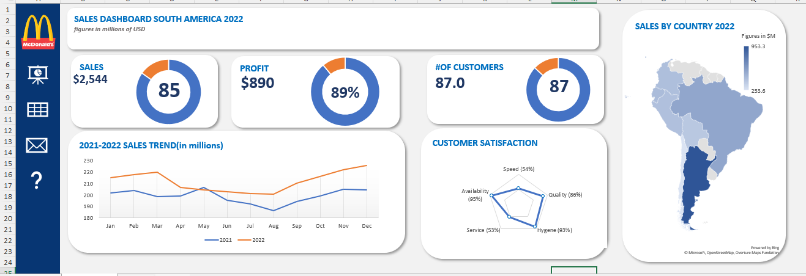

# 📊 Excel Sales Dashboard: South America 2022

One of my first data visualization projects in Excel, analyzing sales performance across South America with key metrics like revenue, profit, and customer satisfaction.

 
*(Dashboard overview — Figure 1 in millions of USD)*

## 🔍 **Project Overview**
- **Goal**: Visualize 2022 sales data for South America to track performance trends.
- **Tools Used**: Excel (PivotTables, Charts, Conditional Formatting).
- **Data Source**: Mock sales dataset (confidential).

## 📈 **Key Metrics**
| Metric          | Value       |
|-----------------|-------------|
| Total Sales     | $2,544M     |
| Profit          | $890M (89%) |
| Top Customers   | 87          |
| Customer Satisfaction | 87%     |

## 🛠️ **Features**
- **Interactive Filters**: Segment data by region, product, or time period.
- **Visualizations**: 
  - Bar/pie charts for sales distribution.
  - Conditional formatting for profit margins.
- **KPI Highlights**: Color-coded metrics for quick analysis.

## 📂 **Files in This Repository**
- `sales-dashboard-south-america.xlsx` - Main Excel file.
- `/assets/` - Contains dashboard screenshot.

## 🚀 **How to Use**
1. Download the `.xlsx` file.
2. Open in **Excel** (or Google Sheets with minor formatting adjustments).
3. Use dropdown filters to explore data.

## 💡 **Lessons Learned**
- Cleaning and structuring raw data for dashboards.
- Using PivotTables to summarize large datasets.
- Designing user-friendly layouts with Excel’s chart tools.

---

**Note**: This project uses mock data for practice.  
